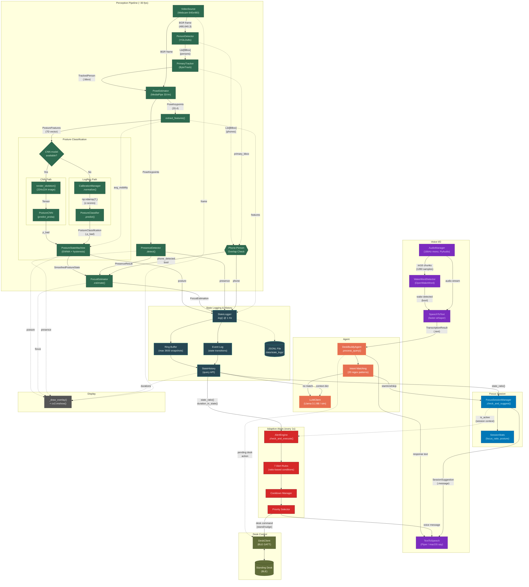

```mermaid
flowchart TB
    %% ──────────────── PERCEPTION PIPELINE ────────────────
    subgraph PERCEPTION["Perception Pipeline (~30 fps)"]
        direction TB

        CAM["VideoSource<br/>(Webcam 640x480)"]
        DET["PersonDetector<br/>(YOLOv8s)"]
        TRK["PrimaryTracker<br/>(ByteTrack)"]
        POSE["PoseEstimator<br/>(MediaPipe 33-lm)"]
        FEAT["extract_features()"]
        PHONE_CHK{{"Phone-Person<br/>Overlap Check"}}

        subgraph POSTURE_PATH["Posture Classification"]
            direction TB
            CNN_CHK{"CNN model<br/>available?"}
            subgraph CNN_PATH["CNN Path"]
                SKEL["render_skeleton()<br/>(224x224 image)"]
                CNN["PostureCNN<br/>(predict_proba)"]
            end
            subgraph LR_PATH["LogReg Path"]
                CAL["CalibrationManager<br/>.normalize()"]
                CLF["PostureClassifier<br/>.predict()"]
            end
            PSM["PostureStateMachine<br/>(EWMA + hysteresis)"]
        end

        PRES["PresenceDetector<br/>.detect()"]
        FOCUS["FocusEstimator<br/>.estimate()"]

        %% Perception edges
        CAM -- "BGR frame<br/>(480,640,3)" --> DET
        DET -- "List[BBox]<br/>(persons)" --> TRK
        DET -. "List[BBox]<br/>(phones)" .-> PHONE_CHK
        TRK -- "TrackedPerson<br/>(.bbox)" --> POSE
        CAM -- "BGR frame" --> POSE
        POSE -- "PoseKeypoints<br/>(33,4)" --> FEAT
        POSE -- "PoseKeypoints" --> PRES
        FEAT -- "PostureFeatures<br/>(7D vector)" --> CNN_CHK

        CNN_CHK -- "Yes" --> SKEL
        SKEL -- "Tensor" --> CNN
        CNN -- "p_bad" --> PSM
        CNN_CHK -- "No" --> CAL
        CAL -- "np.ndarray(7,)<br/>(z-scores)" --> CLF
        CLF -- "PostureClassification<br/>(.p_bad)" --> PSM
        FEAT -. "avg_visibility" .-> PSM

        TRK -. "primary_bbox" .-> PHONE_CHK

        PSM -- "SmoothedPostureState" --> FOCUS
        PRES -- "PresenceResult" --> FOCUS
        PHONE_CHK -- "phone_detected<br/>bool" --> FOCUS
    end

    %% ──────────────── STATE LOGGING ────────────────
    subgraph STATE["State Logging & History"]
        direction LR
        SLOG["StateLogger<br/>.log() @ 1 Hz"]
        RING["Ring Buffer<br/>(max 3600 snapshots)"]
        EVENTS["Event Log<br/>(state transitions)"]
        HIST["StateHistory<br/>(query API)"]
        JSONL[("JSONL File<br/>data/state_logs/")]

        SLOG --> RING
        SLOG --> EVENTS
        SLOG -.-> JSONL
        RING --> HIST
        EVENTS --> HIST
    end

    %% Connect perception → state
    PSM -- "posture" --> SLOG
    FOCUS -- "FocusEstimation" --> SLOG
    PRES -- "presence" --> SLOG
    PHONE_CHK -- "phone" --> SLOG
    FEAT -. "features" .-> SLOG

    %% ──────────────── VOICE I/O ────────────────
    subgraph VOICE["Voice I/O"]
        direction TB
        MIC["AudioManager<br/>(16kHz mono, PyAudio)"]
        WW["WakeWordDetector<br/>(OpenWakeWord)"]
        STT["SpeechToText<br/>(faster-whisper)"]
        TTS["TextToSpeech<br/>(Piper / macOS say)"]

        MIC -- "int16 chunks<br/>(1280 samples)" --> WW
        WW -- "wake detected<br/>(bool)" --> STT
        MIC -- "audio stream" --> STT
    end

    %% ──────────────── AGENT ────────────────
    subgraph AGENT["Agent"]
        direction TB
        CORE["DeskBuddyAgent<br/>.process_query()"]
        INTENT["Intent Matching<br/>(20 regex patterns)"]
        LLM["LLMClient<br/>(Llama 3.1 8B / sim)"]

        CORE --> INTENT
        INTENT -- "no match" --> LLM
    end

    %% ──────────────── FOCUS SESSION ────────────────
    subgraph SESSION["Focus Session"]
        direction TB
        FSM["FocusSessionManager<br/>.check_and_suggest()"]
        STATS["SessionStats<br/>(focus_ratio, posture)"]

        FSM --> STATS
    end

    %% ──────────────── ALERT ENGINE ────────────────
    subgraph ALERTS["Adaptive Alerts (every 1s)"]
        direction TB
        AE["AlertEngine<br/>.check_and_execute()"]
        RULES["7 Alert Rules<br/>(ratio-based conditions)"]
        COOL["Cooldown Manager"]
        PRIO["Priority Selector"]

        AE --> RULES
        RULES --> COOL
        COOL --> PRIO
    end

    %% ──────────────── DESK CONTROL ────────────────
    subgraph DESK["Desk Control"]
        direction TB
        DC["DeskClient<br/>(BLE GATT)"]
        HW[("Standing Desk<br/>(BLE)")]

        DC <--> HW
    end

    %% ──────────────── CROSS-MODULE CONNECTIONS ────────────────

    %% Voice → Agent flow
    STT -- "TranscriptionResult<br/>(.text)" --> CORE
    CORE -- "response text" --> TTS
    CORE -. "pending desk<br/>action" .-> DC

    %% History feeds agent, alerts, session
    HIST -- "context dict" --> LLM
    HIST -- "state_ratio()<br/>duration_in_state()" --> AE
    HIST -- "state_ratio()" --> FSM

    %% Alert engine outputs
    PRIO -- "voice message" --> TTS
    PRIO -- "desk command<br/>(stand/nudge)" --> DC

    %% Focus session outputs
    FSM -- "SessionSuggestion<br/>(.message)" --> TTS

    %% Session context to alerts
    FSM -. "is_active<br/>(session context)" .-> AE

    %% Agent controls session
    INTENT -- "start/end/skip" --> FSM

    %% ──────────────── DISPLAY ────────────────
    subgraph DISPLAY["Display"]
        OVL["_draw_overlay()<br/>+ cv2.imshow()"]
    end

    PSM -. "posture" .-> OVL
    FOCUS -. "focus" .-> OVL
    PRES -. "presence" .-> OVL
    HIST -. "durations" .-> OVL
    CAM -. "frame" .-> OVL

    %% Styling
    classDef perception fill:#2d6a4f,stroke:#1b4332,color:#d8f3dc
    classDef state fill:#264653,stroke:#2a9d8f,color:#e9f5f0
    classDef voice fill:#7b2cbf,stroke:#5a189a,color:#e0c3fc
    classDef agent fill:#e76f51,stroke:#f4a261,color:#fff
    classDef session fill:#0077b6,stroke:#023e8a,color:#caf0f8
    classDef alerts fill:#d62828,stroke:#6a040f,color:#fee2e2
    classDef desk fill:#606c38,stroke:#283618,color:#fefae0
    classDef display fill:#555,stroke:#333,color:#eee

    class CAM,DET,TRK,POSE,FEAT,PHONE_CHK,CNN_CHK,SKEL,CNN,CAL,CLF,PSM,PRES,FOCUS perception
    class SLOG,RING,EVENTS,HIST,JSONL state
    class MIC,WW,STT,TTS voice
    class CORE,INTENT,LLM agent
    class FSM,STATS session
    class AE,RULES,COOL,PRIO alerts
    class DC,HW desk
    class OVL display
```
