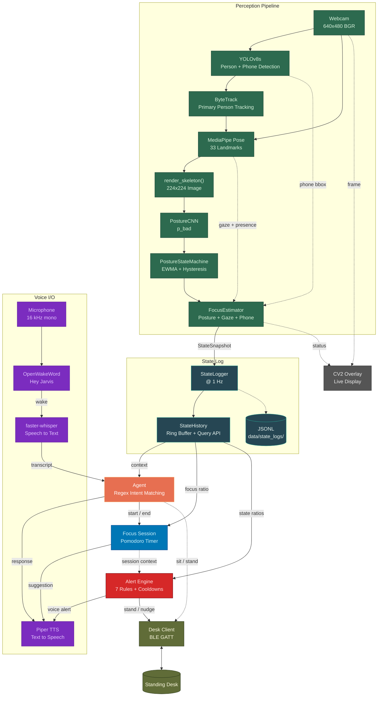

```mermaid
flowchart TB
    %% ──────────────── PERCEPTION ────────────────
    subgraph PERCEPTION["Perception Pipeline"]
        direction TB
        CAM["Webcam<br/>640x480 BGR"]
        DET["YOLOv8s<br/>Person + Phone Detection"]
        TRK["ByteTrack<br/>Primary Person Tracking"]
        POSE["MediaPipe Pose<br/>33 Landmarks"]
        SKEL["render_skeleton()<br/>224x224 Image"]
        CNN["PostureCNN<br/>p_bad"]
        PSM["PostureStateMachine<br/>EWMA + Hysteresis"]
        FOCUS["FocusEstimator<br/>Posture + Gaze + Phone"]

        CAM --> DET --> TRK --> POSE
        CAM --> POSE
        POSE --> SKEL --> CNN --> PSM --> FOCUS
        DET -. "phone bbox" .-> FOCUS
        POSE -. "gaze + presence" .-> FOCUS
    end

    %% ──────────────── STATE ────────────────
    subgraph STATE["State Log"]
        direction LR
        SLOG["StateLogger<br/>@ 1 Hz"]
        HIST["StateHistory<br/>Ring Buffer + Query API"]
        JSONL[("JSONL<br/>data/state_logs/")]

        SLOG --> HIST
        SLOG -.-> JSONL
    end

    FOCUS -- "StateSnapshot" --> SLOG

    %% ──────────────── VOICE ────────────────
    subgraph VOICE["Voice I/O"]
        direction LR
        MIC["Microphone<br/>16 kHz mono"]
        WW["OpenWakeWord<br/>Hey Jarvis"]
        STT["faster-whisper<br/>Speech to Text"]
        TTS["Piper TTS<br/>Text to Speech"]

        MIC --> WW -- "wake" --> STT
    end

    %% ──────────────── AGENT ────────────────
    AGENT["Agent<br/>Regex Intent Matching"]

    STT -- "transcript" --> AGENT
    HIST -- "context" --> AGENT
    AGENT -- "response" --> TTS

    %% ──────────────── SESSION ────────────────
    FSM["Focus Session<br/>Pomodoro Timer"]
    AGENT -- "start / end" --> FSM
    HIST -- "focus ratio" --> FSM
    FSM -- "suggestion" --> TTS

    %% ──────────────── ALERTS ────────────────
    AE["Alert Engine<br/>7 Rules + Cooldowns"]
    HIST -- "state ratios" --> AE
    FSM -. "session context" .-> AE
    AE -- "voice alert" --> TTS

    %% ──────────────── DESK ────────────────
    DESK["Desk Client<br/>BLE GATT"]
    HW[("Standing Desk")]
    AE -- "stand / nudge" --> DESK
    AGENT -. "sit / stand" .-> DESK
    DESK <--> HW

    %% ──────────────── DISPLAY ────────────────
    OVL["CV2 Overlay<br/>Live Display"]
    CAM -. "frame" .-> OVL
    FOCUS -. "status" .-> OVL

    %% Styling
    classDef perception fill:#2d6a4f,stroke:#1b4332,color:#d8f3dc
    classDef state fill:#264653,stroke:#2a9d8f,color:#e9f5f0
    classDef voice fill:#7b2cbf,stroke:#5a189a,color:#e0c3fc
    classDef agent fill:#e76f51,stroke:#f4a261,color:#fff
    classDef session fill:#0077b6,stroke:#023e8a,color:#caf0f8
    classDef alerts fill:#d62828,stroke:#6a040f,color:#fee2e2
    classDef desk fill:#606c38,stroke:#283618,color:#fefae0
    classDef display fill:#555,stroke:#333,color:#eee

    class CAM,DET,TRK,POSE,SKEL,CNN,PSM,FOCUS perception
    class SLOG,HIST,JSONL state
    class MIC,WW,STT,TTS voice
    class AGENT agent
    class FSM session
    class AE alerts
    class DESK,HW desk
    class OVL display
```
